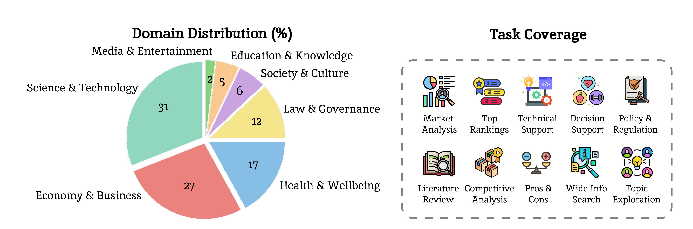

# LiveResearchBench

This is the codebase for [LiveResearchBench: A Live Benchmark for User-Centric Deep Research in the Wild](https://arxiv.org/abs/2510.14240), including both the **LiveResearchBench benchmark** and the **DeepEval evaluation framework** for assessing deep research agents.
LiveResearchBench provides expert-curated, real-world tasks spanning daily life, enterprise, and academia, each requiring extensive, real-time web search, multi-source reasoning, and cross-domain synthesis.
DeepEval offers human-aligned protocols for reliable, systematic evaluation of agentic systems on open-ended deep research tasks.

## 📌 Quick Links
[](https://livedeepresearch.github.io/)
[](https://arxiv.org/abs/2510.14240)
[](https://huggingface.co/datasets/Salesforce/LiveResearchBench)

## Updates
- **[2025.10.31]** DeepEval is here! Our evaluation framework for deep research agents is now live.
- **[2025.10.23]** LiveResearchBench dataset is now available on [Huggingface](https://huggingface.co/datasets/Salesforce/LiveResearchBench)!
- **[2025.10.16]** 📢 LiveResearchBench is officially out on [arXiv](https://arxiv.org/abs/2510.14240)!

## 🔍 About LiveResearchBench
Deep research—producing comprehensive, citation-grounded reports by searching and synthesizing information from hundreds of live web sources---marks an important frontier for agentic systems. To rigorously evaluate this ability, four principles are essential: tasks should be (1) **user-centric**, reflecting realistic information needs, (2) **dynamic**, requiring up-to-date information beyond parametric knowledge, (3) **unambiguous**, ensuring consistent interpretation across users, and (4) multi-faceted and search-intensive, requiring search over numerous web sources and in-depth analysis. Existing benchmarks fall short of these principles, often focusing on narrow domains or posing ambiguous questions that hinder fair comparison. Guided by these principles, we introduce LiveResearchBench, a benchmark of 100 expert-curated tasks spanning daily life, enterprise, and academia, each requiring extensive, dynamic, real-time web search and synthesis. Built with over 1,500 hours of human labor, LiveResearchBench provides a rigorous basis for systematic evaluation. To evaluate citation-grounded long-form reports, we introduce **DeepEval**, a comprehensive suite covering both content- and report-level quality, including coverage, presentation, citation accuracy and association, consistency and depth of analysis. DeepEval integrates four complementary evaluation protocols, each designed to ensure stable assessment and high agreement with human judgments. Using LiveResearchBench and DeepEval, we conduct a comprehensive evaluation of 17 frontier deep research systems, including single-agent web search, single-agent deep research, and multi-agent systems. Our analysis reveals current strengths, recurring failure modes, and key system components needed to advance reliable, insightful deep research.
<p align="center">
     <br>
  Domain distribution and task coverage of LiveResearchBench.
</p>

📖 **For more details on the dataset structure, fields, and usage**, see [**DATASET.md**](docs/DATASET.md).

## 🔍 About DeepEval

DeepEval evaluates research reports across diverse criteria using state-of-the-art LLM-as-a-judges:

- **Presentation & Organization** (Checklist-based)
- **Factual & Logical Consistency** (Pointwise-additive)
- **Coverage & Comprehensiveness** (Checklist-based)
- **Analysis Depth** (Pairwise comparison)
- **Citation Association** (Pointwise-additive)

Each criterion uses the most appropriate evaluation protocol based on human alignment studies, ensuring high-quality, reliable assessments.

## Quick Start

### Installation

```bash
# Clone the repository
git clone https://github.com/your-org/LiveResearchBench.git
cd LiveResearchBench

# Create virtual environment and install dependencies with uv
uv venv
source .venv/bin/activate
uv sync

# Configure API keys
cp .env.example .env
# Edit .env and add your API keys:
#   OPENAI_API_KEY=your-key
#   GEMINI_API_KEY=your-key
#   HF_TOKEN=your-hf-token
```

### Basic usage to evaluate long-form reports

**1. Preprocess Reports** (Create a JSON index mapping queries to report file locations)

**Expected input directory structure:**
```
/path/to/model_outputs/
├── model_name_1/
│   ├── qid_<qid>_report.md
│   ├── qid_<qid>_report.md
│   └── ...
├── model_name_2/
│   ├── qid_<qid>_report.md
│   └── ...
```

```bash
# Process all models in a directory (recommended: use --use-realtime for live benchmark queries)
python preprocess.py /path/to/model_outputs --use-realtime

# Or process specific models (subdirectories) only
python preprocess.py /path/to/model_outputs -m gpt-5-search gemini-pro --use-realtime 

# With custom output directory
python preprocess.py /path/to/model_outputs -o extracted_reports/ --use-realtime

# Optional: Use static queries without placeholder replacement (not recommended for live evaluation)
python preprocess.py /path/to/model_outputs
```

**Expected output structure:**

After preprocessing, a JSON file will be created in `extracted_reports/` (or the specified output directory) with the naming pattern `reports_{timestamp}.json`.

The JSON structure includes:

```python
{
  "metadata": {
    "timestamp": "20250101_120000",              # When the preprocessing was performed
    "total_reports": 300,                         # Total number of reports contained and processed
    "total_models": 3,                           # Number of model outputs included
    "base_path": "/path/to/model_outputs",       # Base path to report outputs directory
    "use_realtime": true                         # Whether to replace query placeholders with real-time values
  },
  "reports": [
    {
      "model_name": "model-name-1",              # Model/system name (subdirectory name)
      "query_id": "abc123xyz",                   # Query identifier from the benchmark
      "query": "Research query text...",         # Query loaded and processed from LiveResearchBench dataset
      "report_file_path": "/path/to/model_outputs/model-name-1/qid_abc123xyz_report.md"
    },
    {
      "model_name": "model-name-2",
      "query_id": "def456uvw",
      "query": "Another research query...",
      "report_file_path": "/path/to/model_outputs/model-name-2/qid_def456uvw_report.md"
    }
    # ... more report entries
  ]
}
```

**2. Grade Single File**

```bash
# Single criterion
python main.py \
    --input extracted_reports/reports_20250101_120000.json \ # the json file created from preprocessing
    --criteria presentation \
    --provider gemini --model gemini-2.5-pro

# Multiple criteria
python main.py \
    --input extracted_reports/reports_20250101_120000.json \
    --criteria presentation,consistency,citation,coverage,depth \
    --provider openai --model gpt-5-2025-08-07
```

**3. Multi-Provider Evaluation** (Recommended for reliability)

```bash
# Automated: Grades with both providers and averages results
# With automatic resume on interruption
python run_multi_provider_evaluation.py --config configs/multi_provider_config.yaml
```

## Evaluation Protocols

Based on our human alignment study, we adopt three different protocols:

### 1. Checklist-Based (Presentation, Coverage)
- **Binary scoring**: 0 (fail) or 1 (pass) for each checklist item
- **Presentation**: 10 fixed quality questions
- **Coverage**: Custom checklist per query

### 2. Pointwise/Additive (Consistency, Citation)
- **Error counting**: Identify and count specific issues
- **Score**: 10-100 based on number of issues found
- **Consistency**: Count logical/factual contradictions
- **Citation**: Count missing citations

### 3. Pairwise Comparison (Depth)
- **Side-by-side comparison**: Compare two reports directly
- **5 dimensions**: Granularity, Insight, Critique, Evidence, Density
- **Position-swap averaging**: Mitigates position bias by comparing in both directions

## Directory Structure

```
LiveResearchBench/
├── liveresearchbench/          # Main Python package
│   ├── common/                 # Shared utilities
│   ├── graders/                # Grading implementations
│   ├── criteria/               # Criterion definitions
│   └── batch_evaluator.py      # Batch grading orchestrator
├── preprocess.py               # Preprocessing script
├── main.py                     # Main grading script
├── average_results.py          # Multi-provider averaging
├── scripts/                    # Bash convenience scripts
├── configs/                    # Configuration files
├── data/                       # Data files (checklists, etc.)
└── tests/                      # Test suite
    ├── test_basic.py           # Unit tests
    ├── test_mock_grading.py    # Integration tests
    └── run_all_tests.sh        # Test runner
```

### Multi-Provider Grading & Averaging

For more reliable results, grade with both GPT-5 and Gemini-2.5-Pro, then average.

```bash
# Step 1: Grade with OpenAI
python main.py \
    --input extracted_reports/reports_20250101_120000.json \
    --criteria presentation,consistency,citation,coverage,depth \
    --provider openai --model gpt-5-2025-08-07 \
    --verbose

# Step 2: Grade with Gemini
python main.py \
    --input extracted_reports/reports_20250101_120000.json \
    --criteria presentation,consistency,citation,coverage,depth \
    --provider gemini --model gemini-2.5-pro \
    --verbose

# Step 3: Average the summary files
python average_results.py \
    --input-a results/reports_20250101_120000_graded_openai_gpt-5-2025-08-07/summary_*.json \
    --input-b results/reports_20250101_120000_graded_gemini_gemini-2.5-pro/summary_*.json \
    --output results/averaged/summary_multi_judge.json
```

### Resume Interrupted Runs

**✨ Automatic Resume**: The system will save incremental JSONL saves! If your grading run is interrupted, simply **run the same command again** - it will automatically resume from where it left off.

```bash
# Original run (gets interrupted)
python main.py \
    --input extracted_reports/my_reports.json \
    --criteria presentation,consistency,citation,coverage,depth \
    --provider gemini \
    --model gemini-2.5-pro

# To resume: Just run the SAME command again!
python main.py \
    --input extracted_reports/my_reports.json \
    --criteria presentation,consistency,citation,coverage,depth \
    --provider gemini \
    --model gemini-2.5-pro

# The system will automatically:
# Load existing results from incremental/ folder
# Skip already graded reports
# Continue grading only unfinished reports
```

**How It Works**: Each graded report is immediately saved to criterion-specific JSONL files in `results/{input}_graded_{provider}_{model}/incremental/`. When you re-run the command, these files are automatically detected and loaded.

**Force Re-grade**: To ignore existing results and start fresh:
```bash
python main.py evaluate \
    --input extracted_reports/my_reports.json \
    --criteria presentation,coverage \
    --provider gemini \
    --force-regrade  # Ignores incremental saves
```

**Monitor Progress**: While grading is running, check real-time progress:
```bash
# Count completed reports
wc -l results/*/incremental/*.jsonl

# View latest result
tail -1 results/my_reports_graded_gemini/incremental/presentation_results.jsonl | jq
```

### Filtering

Grade specific subsets of reports:

```bash
# Filter by experiment name (modify JSON before grading)
# Or process only specific JSON files in batch_config.yaml
```

## API Keys

Set in `.env` file:

```bash
# OpenAI (for GPT-5)
OPENAI_API_KEY=sk-...

# Google Gemini
GEMINI_API_KEY=AIza...
```

## Output Format

### Output Directory Structure

Grading results are organized by input file name, with incremental saves and final timestamped result files:

```
results/
└── reports_{json_file_name}_graded_{provider}_{model_name}/
    ├── incremental/
    │   ├── presentation_results.jsonl    # Real-time saves per criterion
    │   ├── coverage_results.jsonl
    │   ├── consistency_results.jsonl
    │   ├── citation_results.jsonl
    │   └── depth_results.jsonl
    ├── summary_{evaluation_timestamp}.json          # Final summary stats
    └── detailed_results_{evaluation_timestamp}.json # Complete results with all criteria
```

### Summary File (`summary.json`)

Contains aggregated statistics:

```python
{
  "metadata": {
    "provider": "openai",
    "model": "gpt-5-2025-08-07",
    "graded_at": "2025-10-31T01:38:49.407295",
    "total_reports": 10,
    "criteria_evaluated": ["presentation", "coverage", "consistency", "citation"]
  },
  "results_by_model": {
    "model-name-1": {
      "presentation": {
        "mean": 85.5,           # Average pass rate across all reports
        "count": 5,             # Number of reports graded
        "min": 70.0,
        "max": 100.0
      },
      "coverage": { ... },
      "consistency": { ... }
    },
    "model-name-2": { ... }
  },
  "overall_results": {
    "presentation": {
      "mean": 82.3,             # Average across all models/reports
      "count": 10,
      "min": 60.0,
      "max": 100.0
    },
    // ... other criteria
  }
}
```

### Detailed Results File (`detailed_results.json`)

Each report is augmented with grading results:

```json
{
  "reports": [
    {
      "query_id": "qid_123",
      "query": "What is...",
      "report_file_path": "/path/to/report.md",
      
      "presentation_grading_results": {
        "provider": "gemini",
        "model": "gemini-2.5-pro",
        "graded_at": "2025-...",
        "evaluations": {
          "p1": {"score": 1, "justification": "..."},
          "p2": {"score": 0, "justification": "..."}
        },
        "summary": {
          "total_criteria": 10,
          "passed_count": 8,
          "average_pass_rate": 80.0
        }
      },
      
      "consistency_grading_results": {
        "provider": "gemini",
        "model": "gemini-2.5-pro",
        "graded_at": "2025-...",
        "specific_issues": ["Issue 1...", "Issue 2..."],
        "total_issues": 2,
        "score": 90,
        "justification": "..."
      }
    }
  ]
}
```
## License

The dataset is released for research purposes only under CC-BY-NC 4.0 and should not be used to develop models that compete with OpenAI. The evaluation code is released under Apache 2.0.

## Citation

If you find LiveResearchBench helpful, please consider citing:

```bibtex
@article{sfr2025liveresearchbench,
      title={LiveResearchBench: A Live Benchmark for User-Centric Deep Research in the Wild}, 
      author={Jiayu Wang and Yifei Ming and Riya Dulepet and Qinglin Chen and Austin Xu and Zixuan Ke and Frederic Sala and Aws Albarghouthi and Caiming Xiong and Shafiq Joty},
  year={2025},
  url={https://arxiv.org/abs/2510.14240}
}
```